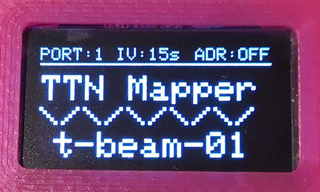
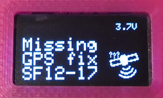
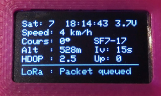

## Intro

This Fork from Bjoerns-TB, forked from DeuxVis, supports OLED display on the I²C interface on GPIO22 and GPI21. This repo contains a patched SSD1306 library from [smartnick](https://github.com/smartinick/Adafruit_SSD1306), enabling individual I²C pins and to set I²C Clock to 800kHz.

This is a simple sketch demonstrating the capability of the [TTGO T-Beam](https://www.aliexpress.com/store/product/TTGO-T-Beam-ESP32-433-868-915Mhz-WiFi-wireless-Bluetooth-Module-ESP-32-GPS-NEO-6M/2090076_32875743018.html) as a [TTN Mapper](https://ttnmapper.org/) Node on [The Things Network](https://www.thethingsnetwork.org/) LoraWAN.

Derived from [sbiermann/Lora-TTNMapper-ESP32](https://github.com/sbiermann/Lora-TTNMapper-ESP32) and with some information/inspiration from [cyberman54/ESP32-Paxcounter](https://github.com/cyberman54/ESP32-Paxcounter) and [Edzelf/LoRa](https://github.com/Edzelf/LoRa).

## New features

* GPS scan relaxed and done more "nonblocking"
* more informations shown on status screen
* animated GPS-fix-screen with satelite gfx
* selectable datarate and power (button short press)
* selectable transmit interval (button longer press)
* selectable ADR-Mode (button even longer press)
* selectable send-port to enable "on device" switch to experimental mapping (button even loooonger press)

 

## Software dependencies

Arduino IDE [ESP32 extension](https://github.com/espressif/arduino-esp32)

[TinyGPS++](http://arduiniana.org/libraries/tinygpsplus/)

[LMIC-Arduino](https://github.com/matthijskooijman/arduino-lmic) : Make sure to get the last version - *1.5.0+arduino-2* currently - because the arduino IDE library updater is getting confused by the versioning scheme of that library.

## Instructions

You can program the T-Beam using the [Arduino ESP32](https://github.com/espressif/arduino-esp32) board 't-beam'.

It is suitable for t-beam HW-Version up to V07. Higher versions (Soft-Power-Button) need different software.

On The Things Network side, the settings needed are available [here](https://www.thethingsnetwork.org/docs/applications/ttnmapper/).

Configure the Payload decoder with:
```javascript
function Decoder(bytes, port) {
    var decoded = {};

    decoded.latitude = ((bytes[0]<<16)>>>0) + ((bytes[1]<<8)>>>0) + bytes[2];
    decoded.latitude = (decoded.latitude / 16777215.0 * 180) - 90;
  
    decoded.longitude = ((bytes[3]<<16)>>>0) + ((bytes[4]<<8)>>>0) + bytes[5];
    decoded.longitude = (decoded.longitude / 16777215.0 * 360) - 180;
  
    var altValue = ((bytes[6]<<8)>>>0) + bytes[7];
    var sign = bytes[6] & (1 << 7);
    if(sign)
    {
        decoded.altitude = 0xFFFF0000 | altValue;
    }
    else
    {
        decoded.altitude = altValue;
    }
  
    decoded.hdop = bytes[8] / 10.0;

    return decoded;
}
```
